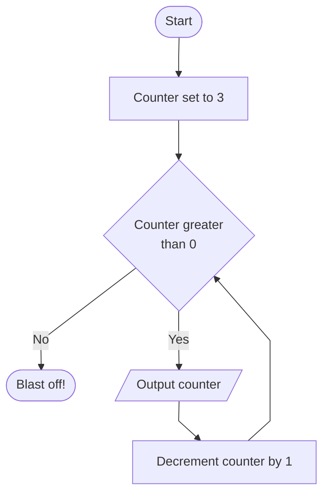

# ZDAT2003 Applied Machine Learning - Assessment 2

## Contents

- [Overview](#overview)
- [Project Structure](#project-structure)
- [Markdown Formatting](#markdown-formatting)
  - [Code](#code)
  - [Maths](#maths)
  - [Tables](#tables)
  - [Diagrams](#diagrams)
  - [Images](#images)
- [Questions](#questions)

## Overview

Please read this documentation **in conjunction** with the information sheet provided on Moodle.

This is a template project for Assessment 2 of ZDAT2003. You can mostly change this as you like, but ensure that it is clear what you have done and where relevant data and information can be found. You should change the contents of the `README.md` and `REPORT.md` files to reflect your project but **should not** change their names or locations.

## Project Structure

The project is structured as follows:

```plaintext
dsda-zdat2003-assessment-2/
├── doc/
├── img/
├── src/
├── README.md
└── REPORT.md
```

- `doc/`: Contains any project documentation that doesn't fit elsewhere in the project.
- `img/`: Contains images used in the report and documentation. This should include any generated and saved plots during the course of your project (e.g. generated from Matplotlib or Seaborn in Jupyter notebooks). Please **do not** rely on images only being generated at runtime. Save them to this directory and reference them in the report and documentation. The code to generate each plot **must** still exist, however.
- `src/`: Contains the source code for the project. This will include Jupyter notebooks, Python files, and any other code used in the project. Your experiments must be reproducible, so ensure that all code is present and that the code can be run to generate the same results in the report.
- `README.md`: This file. It should contain an overview of the project and how to run the code as well as a brief description of the project structure and the contents of the other files.
- `REPORT.md`: A report on the project. The `REPORT.md` file should be somewhat self-contained and not require running code later to generate graphs. Whilst it should be possible to run the code and generate the graphs, the report should be able to stand alone and reflect the final version that you are happy to be marked.

## Markdown Formatting

You should make use of Markdown formatting in the documentation and report. This will make it easier to read and understand. You can use the [Markdown Cheatsheet](https://www.markdownguide.org/cheat-sheet/) to help you with this. Note how you can easily include things like links, tables, images, and code blocks. Some useful examples are included below but you can use any Markdown formatting you like. Note that there are variations in how Markdown is rendered in different places (e.g. GitHub, VS Code, etc.) so you may need to check how it looks in different places to ensure it is readable.

### Code

You can include code inline by wrapping it in backticks. For example, `print("Hello, world!")`. Larger code blocks are a way to present snippets code. For example:

```python
def countdown(n):
    for i in range(n, 0, -1):
        print(i)
    print("Blast off!")
```

### Maths

You can [include maths in Markdown using LaTeX](https://docs.github.com/en/get-started/writing-on-github/working-with-advanced-formatting/writing-mathematical-expressions) and write an inline equation using single dollar signs (`$`) and a block equation using double dollar signs (`$$`). For example, the quadratic formula can be written inline ($x = \frac{-b \pm \sqrt{b^2 - 4ac}}{2a}$) or on a new line:

$$x = \frac{-b \pm \sqrt{b^2 - 4ac}}{2a}$$

### Tables

Embedded tables can be used to present data in a more legible format than an image of a table. For example:

| Count | Output     |
|-------|------------|
| 3     | 3          |
| 2     | 2          |
| 1     | 1          |
| 0     | Blast off! |

### Diagrams

Mermaid diagrams can be used in the documentation and report. For example, the following code will generate a flowchart when you preview it. (For VS Code you may need to [add an extension for Mermaid diagrams in Markdown](https://marketplace.visualstudio.com/items?itemName=bierner.markdown-mermaid).) You can also use the [Mermaid Live Editor](https://mermaid-js.github.io/mermaid-live-editor/) to generate diagrams and then copy the code into your documentation. If you prefer, you could also use a different tool to generate diagrams and include them as images.



### Images

Images should be extensively used for any plots or diagrams that you want to include in the report or documentation. It's generally good practice to save these images to a single location (e.g. the `img/` directory) and reference them in the report and documentation. You can include images in the report and documentation using Markdown or HTML. **Don't use a GitHub or web URL for images, as this will not work when you submit the project as a zip file! Ensure that you link to them using *relative* paths.**


## Questions

If you have any questions about the project or this template, please reach out to Adam Walker via [email](mailto:adam.walker1@nottingham.ac.uk) or [MS Teams](https://teams.microsoft.com/l/chat/0/0?users=Adam.Walker1@nottingham.ac.uk).
